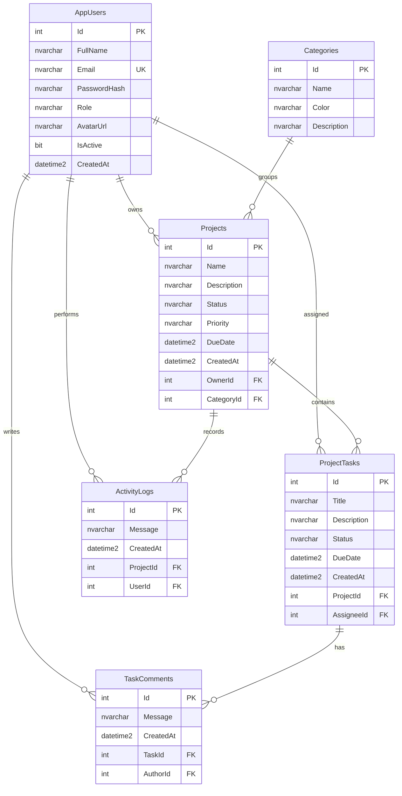

# TaskHub Project Report

## Overview

TaskHub is a full-stack project and task management system built with the required stack:

- Frontend: Angular, TypeScript, HTML, CSS
- Backend: ASP.NET Core Web API in C#
- Database: SQL Server

The application supports JWT authentication, user-specific dashboards, project and task CRUD, task comments, profile routing, and an admin panel for workspace data management.

## Frontend Requirement Mapping

| Requirement | Implementation |
| --- | --- |
| Home / Landing | `frontend/src/app/pages/home` has a hero section, CSS animations, rotating metrics, and data-driven feature tiles. |
| Authentication | `frontend/src/app/pages/auth` provides login/signup with Angular Reactive Forms and validation. |
| Dashboard | `frontend/src/app/pages/dashboard` loads user-specific metrics from `GET /api/dashboard`. |
| Main Feature Page | `frontend/src/app/pages/projects` provides project CRUD, filtering, and API-backed data. |
| Detail / Profile Page | `frontend/src/app/pages/project-detail` and `frontend/src/app/pages/profile` use Angular Router dynamic params. |
| Admin Panel | `frontend/src/app/pages/admin` manages users and categories with CRUD operations. |
| Components, Services, Routing, Directives | Standalone Angular components, API services, route guards, and `StatusHighlightDirective` are used. |
| Reactive Forms | Auth, project, task, comment, user, and category forms use Angular Reactive Forms. |
| HTTP Client | All dynamic data is loaded through Angular services using `HttpClient`. |
| Responsive CSS | `frontend/src/styles.css` uses CSS Grid, Flexbox, and responsive media queries. |
| Vanilla JS DOM | `DomNotesComponent` uses `document.createElement`, `addEventListener`, form handling, and live DOM updates. |

## Backend Requirement Mapping

| Requirement | Implementation |
| --- | --- |
| ASP.NET Core Web API | `backend/TaskHub.Api.csproj` and `backend/Program.cs` |
| JWT Authentication | `AuthController`, `JwtTokenService`, and JWT bearer middleware |
| Minimum 4 CRUD controllers | `UsersController`, `CategoriesController`, `ProjectsController`, `TasksController`, `CommentsController` |
| Proper status codes | Controllers return `Ok`, `CreatedAtAction`, `BadRequest`, `Unauthorized`, `Forbid`, `NotFound`, `Conflict`, and `NoContent`. |
| RESTful API design | Routes are grouped under `/api/{resource}` with GET, POST, PUT, DELETE methods. |

## API Summary

| Resource | Endpoints |
| --- | --- |
| Auth | `POST /api/auth/signup`, `POST /api/auth/login`, `GET /api/auth/me` |
| Dashboard | `GET /api/dashboard` |
| Users | `GET /api/users`, `GET /api/users/active`, `GET /api/users/{id}`, `POST /api/users`, `PUT /api/users/{id}`, `DELETE /api/users/{id}` |
| Categories | `GET /api/categories`, `GET /api/categories/{id}`, `POST /api/categories`, `PUT /api/categories/{id}`, `DELETE /api/categories/{id}` |
| Projects | `GET /api/projects`, `GET /api/projects/{id}`, `POST /api/projects`, `PUT /api/projects/{id}`, `DELETE /api/projects/{id}` |
| Tasks | `GET /api/tasks`, `GET /api/tasks/{id}`, `POST /api/tasks`, `PUT /api/tasks/{id}`, `DELETE /api/tasks/{id}` |
| Comments | `GET /api/comments`, `GET /api/comments/{id}`, `POST /api/comments`, `PUT /api/comments/{id}`, `DELETE /api/comments/{id}` |

## Database Tables

| Table | Purpose |
| --- | --- |
| `AppUsers` | Stores accounts, roles, password hashes, and profile data. |
| `Categories` | Groups projects by business area. |
| `Projects` | Stores project planning, status, priority, owner, and category data. |
| `ProjectTasks` | Stores work items assigned to users inside projects. |
| `TaskComments` | Stores task discussions. |
| `ActivityLogs` | Stores project activity history for the dashboard and details page. |

## Database Schema Diagram

## Setup

1. Run `database/schema.sql` in SQL Server.
2. Run `database/seed.sql` in the same database.
3. Start the backend from `/backend` with `dotnet restore` and `dotnet run`.
4. Start the frontend from `/frontend` with `npm install` and `npm start`.

Demo accounts:

- Admin: `admin@taskhub.local` / `Admin123!`
- User: `maya@taskhub.local` / `User123!`
